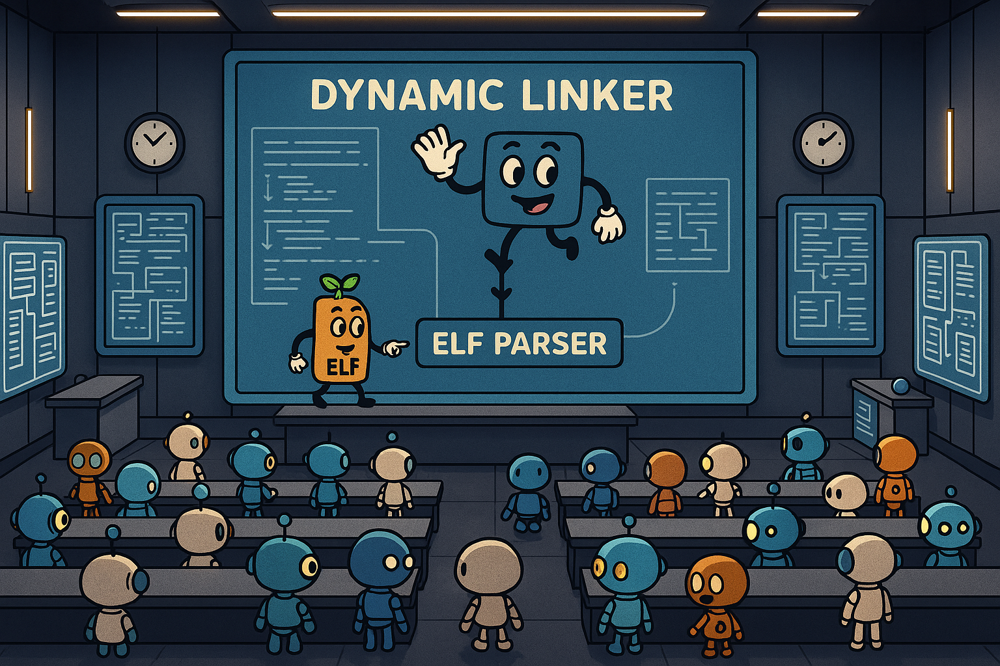

# Executable and Linkable Format (ELF) and Dynamic Linker



Today, we are going to build a program that parses ELF files, loads it into the memory, performs relocations, runs it, and makes the program automatically link to shared libraries during runtime. All this on bare-metal hardware without OS! This will demistify most of the things that the OS does when we run a program on shell (`make` ➡️ `./foo`), as well as how it is able to link our programs to shared libraries (ex. how a call to `printf` automatically links to `libc.so`). It will be a lot of fun! Yay! 🥳

**Check-off: Finish parts 0, 1, 2, and 3**

## Background 1: How we ran programs on Raspberry Pi so far

Throughout CS140E and CS240LX, we've been statically linking everything, and passed the raw instructions to our R/pi through our bootloader. If you've been paying attention to the Makefiles we use in the labs, you could've seen that the process is roughly:

1. Compile all the source codes under `./libpi` directory and whatever lab directory you are in with `arm-none-eabi-gcc` ➡️ this produces individual object files (`*.o`), which are ELF files
2. Link together all the object files created under `./libpi` into a static library with `arm-none-eabi-ar` (archiver) ➡️ this produces `libpi.a`, a collection of ELF files
3. Link together `libpi.a` and all the object files created under your lab directory into an executable with `arm-none-eabi-ld` (linker) ➡️ this produces an executable (ex. `my-test.elf`), also an ELF file
4. Strip away all ELF/linker metadata and only keep the raw `.text`, `.rodata`, and `.data` sections from the above ELF executable with `arm-none-eabi-objcopy -O binary` ➡️ no longer an ELF file 😥 we send THIS to the pi-side bootloader, which loads the binary into memory and jumps to 0x8000

This approach, while appropriate for bare-metal programming, does have some downsides:

- The final executable is redundant with our pi-side bootloader, because both contain subsets of `libpi.a` (e.g., the UART driver).
- We cannot directly run ELF binaries (i.e., always have to port things into our build system).
- We cannot use shared libraries, because we don't have a way to dynamically link them. Everything has to be statically linked at compile-time.

After today's lab, we should be able to directly send the ELF binary, instead of the stripped binary, to the pi-side bootloader to run a program. Also, you should have all the pieces to be able to upgrade our bootloader to a fully-fledged dynamic loader/linker and ELF32 parser. Ultimately, we will have 0 redundancy in code, because anything redundant will be in our new shared library, `libpi.so`, which is loaded once to memory from the FAT32 filesystem and dynamically linked on-demand.

To recap, the benefits are:

- We can build smaller executables that only contain the new code (no more `printk` definition in every executable), thus faster build and bootloading.
- We can build our `libpi` as a shared library (`libpi.so`), keep it on R/pi's FAT32 filesystem, and dynamically link it at runtime only when needed.
- We can run 3rd-party executables and/or use external shared libraries (if you are really ambitious, you can try porting in a couple functions from the standard C library, `libc.so`).

## Background 2: Executable and Linkable Format (ELF)

The [Wikipedia page](https://en.wikipedia.org/wiki/Executable_and_Linkable_Format) is helpful, as well as [this GitHub page](https://gist.github.com/x0nu11byt3/bcb35c3de461e5fb66173071a2379779). But if you don't have time, looking at the provided [reference sheet](./docs/ELF.pdf) under this directory is sufficient.

Basically, ELF is the standard binary format on many Unix-based and Unix-like operating systems. As its name suggests, it is used to represent executable files (ex. `my_program`), as well as object code (ex. `my_program.o`) and shared libraries (ex. `libpi.a` or `libc.so`). Why use a common format for binaries instead of directly writing machine instructions to binary files? Portability. The operating system can use ELF headers to determine how to parse different types of binaries, or to reject a binary as uninterpretable based on its metadata. ELF metadata also provides other useful information, such as the binary's endianness and its entry point (the address where the OS should begin execution of the program).

The basic structure of an ELF file is fairly simple; it consists of **4 main parts**:

```plaintext
    ----------------------------------
    |            ELF Header          |
    ----------------------------------
    |      Program Header Table      |
    ----------------------------------
    |           Sections             |
    |  (.text, .data, .symtab, ...)  |
    ----------------------------------
    |      Section Header Table      |
    ----------------------------------
```

Here's a more fancy, detailed diagram:


The **ELF Header** is the first component of an ELF file and contains general metadata such as the magic number, architecture (e.g., x86 or ARM), address size (32-bit or 64-bit), endianness, entry point address, and offsets to the program and section header tables.

The **Program Header Table** describes how to load the ELF file into memory. Each entry in the program header table corresponds to a *segment* and tells the loader which parts of the file should be mapped into memory, where in the virtual memory space they should be loaded, what permissions they require (read, write, execute), and their size in the file and in memory. This table is essential during runtime but not during compile-time. 

If we were being really precise, we would use the R/pi’s virtual memory system to map segments and enforce access controls according to the program header table. This is useful because it allows us to avoid loading unnecessary parts of the ELF binary (e.g., `.symtab`), prevent execution of non-executable segments, and etc. This would make a great extension--we already have all the pieces needed. But for today, *we ignore the program header table*.

**Sections** are the actual contents of the binary: code, data, symbols, relocation information, and much more. Common sections include `.text`, `.data`, `.bss`, `symtab`, etc.

The **Section Header Table** describes each section in the ELF file: section name (e.g., `.text`), type, memory address, size, and offset in the file. This is what you use to actually locate the individual sections. It is mainly used by linkers and debuggers.

Our workflow with ELF for today is fairly simple:

1. Read the ELF header ➡️ We verify that the file we are reading is in fact an ELF file, locate the section header table, and find the program entry point.
2. Read the section header table ➡️ We locate the sections we are interested in (specifically, `.bss`, `dynamic`, `.hash`, `.dynsym`, `.dynstr`, `.got.plt`, and `.rel.dyn`).
3. Read each section ➡️ Do whatever we need to do (e.g., zero-initialize, relocate symbols, modify code, etc.)
4. Jump to the program entry point.

## Part 0: Compile ELF Files and Move Them to Your SD Card (3 min)

**Check-off:**
- Run `make` in the following directories: `0-my-libpi`, `0-my-static-tests`, and `0-my-dynamic-tests`
- Copy the resulting ELF files to your SD card

It is 😡😡😡 to repeatedly move files between your host machine and R/Pi. So we'll move everything we need now, and never remove the SD card again during today's lab.

We're copying files from 3 directories, each serving a different purpose:

- `0-my-libpi`: `make` will produce two files: `libpi.a` (a static library) and `libpi.so` (a shared dynamic library). We use `libpi.a` to compile `0-my-static-tests`. We use `libpi.so` for dynamic linking in later parts and extensions. `libpi.a` is only needed at compile time. `libpi.so` needs to be loaded during runtime. So **copy `libpi.so` to your SD card**.
- `0-my-static-tests`: make sure you generated `libpi.a` from the first step and run `make`. This will create statically linkned ELF executables we use for part 1. **Copy all `*.elf` files (`0-static.elf`, `1-static.elf`, `2-static.elf`, `3-static.elf`) to your SD card**.
- `0-my-dynamic-tests`. make sure you generated `libpi.so` from the first step and run `make`. This will create dynamically linked ELF executables you need for part 2, 3, and extensions. **Copy all `*.elf` files (`0-dyn.elf`, `1-dyn.elf`, `2-dyn.elf`, `3-dyn.elf`) to your SD card**.

I highly recommend reading the build commands in the Makefiles and inspecting the helper files generated (`*.readelf`, `*.list`). But if you're short on time, just make sure all the required files are copied to the SD card before moving on to Part 1.

When you run `ls` on your SD card, you should see:

```bash
> ls
0-dyn.elf          3-dyn.elf
0-static.elf       3-static.elf
1-dyn.elf          ...
1-static.elf       libpi.so
2-dyn.elf          ...
2-static.elf
```

The way we are building binaries today differs from how we typically do it in the labs:

- `0-my-libpi`: We build `libpi.a` (the usual static library we build) and `libpi.so`. `libpi.so` is a position-independent shared library that we'll place in the FAT32 partition and link to our programs at runtime. For that, `-fPIC` flag is passed to the compiler and `-shared` flag is passed to the linker. We also strip away the debug sections (`--strip-debug`) to keep the file sizes small.
- `0-my-static-tests`: These are statically linked with `libpi.a`. It is exact same build flow that we use during normal labs, except for the part where we strip away all metadata and only keep `.text`, `.rodata`, and `.data` sections. If you look into `.list` files generated, you can see that the symbols from `libpi` are included within. We'll use these in Part 1 to load and run statically linked ELF binaries from memory.
- `0-my-dynamic-tests`: These are dynamically linked with `libpi.so`. The linker is passed `-lpi` flag to indicate that unresolved symbols should be looked up in libpi.so at runtime. You can verify this by looking into the `.list` files generated, where none of the symbols from `libpi` are included, and all references to those symbols point to the Procedure Linkage Table (PLT). This will be resolved during runtime on-demand.

Also note that the file names are kept short to fit within the FAT32 8.3 filename format.

Make sure to run `sync` before you eject your SD card so that all data is properly written to disk.

## Part 1: Load, Parse, and Execute ELF Files

**Check-off:**
- Fill in `verify_elf(...)`, `bss_zero_init(...)`, and `jump_to_elf_entry(...)` in `my-elf-loader.c`
- Run `make` with `exec_filename` in `notmain.c` set to at least 2 different statically linked ELF files

**TL;DR: Read through `notmain.c` to understand the program flow. Fill in the `todo`s in `my-elf-loader.c`**

Now that all required files are on the SD card, it's time to begin reading and executing ELF files! Woohoo!

But before we even begin, who should be loading and executing the ELF files?

If we are to build a more "complete" system, ELF loading and linking would typically be handled by the pi-side bootloader, so that we can simply send a full ELF executable through our Unix-side bootloader. This is a great extension (and how I did it in 140E), but it can be very frustrating to debug, especially when you have to reinsert the SD card every time you recompile. Thus, today's hack:

- We put the ELF binaries we want to load in the SD card (done in part 0)
- After implementing our ELF loader, we compile it and strip off all ELF/linker metadata (as we usually do), and execute this through our already-existing unix/pi bootloader infrastructure
- The pi-side bootloader will load and execute the ELF loader; the ELF loader will load and execute the ELF executable from the FAT32 filesystem

Although not so authentic, it will let us iterate quickly and get the job done.

Also, we need to be very careful about memory layout. At this point, we’re loading and running multiple components in memory: the Pi bootloader, our ELF loader, the test program itself, and later, shared libraries. These must not overlap. While there are many ways to do this, the given code intends to do the following:

```plaintext

    0xFFFF'FFFF ----------------
                |              |
                |   UNUSABLE   |
                |              |
    0x2030'0000 ----------------
                |              |
                |  Peripherals | <-- MMIO
                |              |
    0x2000'0000 ---------------- <-- end of RPi's 512 MB RAM
                |              |
                |    SHARED    |
                |  LIBRARIES   | <-- we'll load libpi.so here
                |              |
    0x1000'0000 ----------------
                |              |
                |    UNUSED    |
                |              |
    0x0900'0000 ----------------
                |              |
                |   INTERRUPT  |
                |     STACK    |
                |              |
    0x0890'0000 ----------------
                |              |
                |    UNUSED    |
                |              |
    0x0800'0000 ----------------
                |              |
                |     STACK    |
                |              |
    0x002?'0000 ----------------
                |              |
                |  BOOTLOADER  | <-- can be overwritten after loader/linker runs
                |              |
    0x0020'0000 ----------------
                |              |
                |     HEAP     |
                |              |
    0x0010'0000 ----------------
                |              |
                |  OUR LOADER/ | <-- can be overwritten after our test program runs
                |    LINKER    |
                |              |
    0x0001'0000 ---------------- <-- could be higher, but the tests we use today are sufficiently small
                |              |
                | TEST PROGRAM | <-- entrypoint no longer depends on config.txt (we can decide)
                |              |
    0x0000'0000 ----------------

```

So the strategy:

- The pi-side bootloader starts at 0x0020'0000, same as how we implemented it in CS140E
- The ELF loader is placed at 0x0001'0000, using the `.space` + `b skip` trick in `start.S` as we did in CS140E. This is required because the pi-side bootloader loads programs at 0x8000, and this is low enough address to collide with our test program, which should load at 0x0. Also note that while 0x0001'0000 is also a pretty low address, we can get away with this because the test programs for today are small. If we increase the starting address the bootloading time gets longer. If you don't like this: just rewrite the pi-side bootloader to do the ELF parsing and loading (extension).
- The test program is loaded at 0x0
- Later in Part 2, shared libraries will be loaded at a higher, unused address (0x1000'0000) to avoid overlap.

Another challenge is reading the ELF files from the FAT32 filesystem. While you can certainly use your FAT32 driver from 140E, this is certainly not the focus of this lab. So all the driver code is given in `./1-my-elf-loader/static-deps` and you only need to use one function defined in `my-fat32-driver.h`:

```C
// This is very unique to our Pi setup. `buffer` points to a physical address.
// Neither the caller or this function allocates anything. It just writes to
// the physical address pointed to by `buffer`, and return the number of bytes written.
int my_fat32_read(char *name, char *buffer);
```

Where `name` is the filename (in all caps) and buffer is a pointer to the starting address where the file should be loaded to.

For part 1, we use the statically linked ELF files (i.e., no need to dynamically resolve symbols).

Okay, now that we have a way to read files from the SD card, and planned out how we are going to use the memory, we can finally start parsing the ELF files. Your job is to implement the actual ELF loading logic:

- Load the ELF file from FAT32 into memory (starting at address 0x0).
- Parse the ELF header using the structs defined in my-elf-reader.h.
- Verify key fields (e.g., magic number, file type, architecture) to ensure the file is valid.
- Locate the `.bss` section and zero-initialize it.
- Find the entry point from the ELF header.
- Branch to the entry point to start executing the program.

Refer to the comments in `my-elf-loader.c` for guidance and reference notes. The code is fairly straightforward once you dive in. I recommend starting with `notmain.c` to understand the program flow first.

When you are all done, you should see something like the following when you run `make` with `0-static.elf`:

```bash
> make
...
[MY-ELF] ELF file loaded into memory (0x0 - 0x1e50)
[MY-ELF] ELF file magic number verified
[MY-ELF] ELF file type verified
[MY-ELF] ELF file architecture verified
[MY-ELF] BSS section zero-initialized (0x1048 - 0x1050)
[MY-ELF] Entry point: 0x500
[MY-ELF] Branching to the entry point
BSS var: 0
Hello, world!
DONE!!!
```

## Part 2: Runtime Symbol Resolution for Shared Libraries

**Check-off:**
- Fill in `get_dynamic_sections(...)` and `resolve_symbol(...)` in `my-dynamic-linker.c`
- Run `make` and show that it can correctly resolve and jump to `printk`

**TL;DR: Read through `notmain.c` to understand the program flow. Fill in the `todo`s in `my-dynamic-linker.c`**

**Useful: Read `./0-my-libpi/libpi.so.readelf`**

Now that you’re familiar with parsing ELF files, locating symbols inside them is fairly straightforward. So the goal: load `libpi.so` into memory, resolve the address of `printk`, and jump to it.

But before we jump into symbol resolution, let’s optimize the process a bit. It's kind of redundant to locate the relevant sections in ELF file every time we need them. Instead of doing that, we will first implement a helper function `get_dynamic_sections(...)` to populate a utility struct `my_elf32`:

```C
// Just a bunch of useful addresses.
typedef struct {
    // Headers
    elf32_header   *e_header;
    elf32_pheader  *e_pheaders;
    elf32_sheader  *e_sheaders;

    // Essential sections for dynamic linking
    elf32_dynamic *e_dynamics;
    uint32_t       n_dynamics; // number of entries in .dynamic section
    uint32_t      *e_hash;
    elf32_sym     *e_dynsym;
    char          *e_dynstr;
    uint32_t      *e_pltgot;
    elf32_rel     *e_reldyn;
} my_elf32;
```

You only need to fill in the last seven fields in get_dynamic_sections(...), as the first 3 are filled in `notmain()`. Not all of the fields are required for Part 2, but it’s worth populating all of them; they’ll come in handy in Part 3 and extensions.

While you could certainly locate these sections using the section header table, the better approach is to use the `.dynamic` section. This utility section contains information about all the key sections used in dynamic linking. You can see these entries in `libpi.so.readelf`. I highly recommend locating the sections through the `.dynamic` section, because it lets us avoid going through the section header string table and doing string comparisons. Thus, the flow:

1. Locate the `.dynamic` section by iterating over the section header table.
2. Locate rest of the sections by iterating over the dynamic table.

Refer to 1-10, 2-11, 2-12, and 2-13 of the [reference sheet](./docs/ELF.pdf) for the `.dynamic` section format.

Once the utility struct `my_elf32` is populated, the next step is **relocation**. Since `libpi.so` contains position-independent code, its symbols need to be relocated at runtime. This requires going through the relocation tables (`.rel.dyn` and `.rel.plt`) and filling in the global offset table (`.got`). It also requires some edge-case handling and some reverse engineering because our reference sheet doesn't match the values generated by our compiler toolchain. Good news: this is already done for you in `load_time_relocation(...)`. So no worries here!

With the relocation done and essential sections located, we are now ready to resolve symbols! Fill in the function `resolve_symbol(...)`. The logic is very simple:

1. Iterate over each entry in the dynamic symbol table (`.dynsym`)
2. For each entry, retrieve its string representation from the dynamic string table (`.dynstr`), and compare it to the given symbol name. If the strings match, we found the symbol. Yay!
3. Retrieve the symbol address from the dynamic symbol table entry and return it

Refer to 1-17 for the symbol entry format and 1-16 for the string table format. The way symbol table and string table relate to each other in ELF files is simple yet fascinating!

A great (and highly recommended) extension is to use the `.hash` section to locate the symbols in amortized O(1) time.

When you are all done, you should see output similar to this when you run `make`:

```bash
> make
...
[MY-ELF] ELF file loaded into memory (0x10000000 - 0x10015e20)
[MY-ELF] ELF file magic number verified
[MY-ELF] ELF file type verified
[MY-ELF] ELF file architecture verified
[MY-ELF] BSS section zero-initialized (0x100101cc - 0x100107e4)
[MY-DL] Identifying ELF32 dynamic sections...
[MY-DL] Found dynamic sections: .hash: 0x1000ea38, .dynsym: 0x1000ce10, .dynstr: 0x1000dd20, .got.plt: 0x10010024, .rel.dyn: 0x1000f4d8
[MY-DL] Performing load-time relocation of all the symbols in shared library
[MY-DL] Resolving symbol <printk>...
[MY-DL] Found symbol: printk at 0x10006e8c
Hello from the resolved symbol!!!
Should reach here as well!
DONE!!!
```

## Part 3: Dynamic Linking

**Check-off:**
- Fill in `dynamic_linker_entry_c(...)` in `my-legit-dynamic-linker.c`
- Run `make` with `exec_filename` in `notmain.c` set to at least 2 different dynamically linked ELF files
- Show that dynamic linking occurs **automatically and on-demand during runtime**

**TL;DR: Read through `notmain.c` to understand the program flow. Fill in the `todo` in `my-legit-dynamic-linker.c`**

**Very, very useful: In `./0-my-dynamic-tests/0-dyn.elf.list`, trace what happens when `printk` is called in `notmain`. Calculate the PC at each instruction and understand what is going on**

What we did up to part 2 is useful. It is pretty much all we need to perform compile-time or load-time linking. But how do we perform *runtime* dynamic linking? We can't just randomly interrupt control flow when a program encounters an unresolved symbol. We need to do something else.

The ultimate trick is: **the linker prepares it all** for you. When compiling dynamically linked executables, the linker sets up:

- Stub functions in the `.plt` (Procedure Linkage Table) section
- Jump addresses in the `.got.plt` (Global Offset Table) section

These two sections allow us to:

- Defer symbol resolution until runtime
- Dynamically resolve symbols on-demand
- Have each symbol resolved only once, and subsequent calls jump directly to the resolved address (if you want to understand deeply, I recommend [this blog post](https://blog.memzero.de/dynamic-linking-linux-x86-64/), as well as going through `./0-my-dynamic-tests/0-dyn.elf.list` yourself).

Then, the linker modifies the calls to unresolved symbols to do the following:

- The program runs normally until it hits a call to an unresolved symbol (e.g., `printk`).
- Instead of calling `printk` directly, the code calls a stub function in `.plt`. Let's call this `printk@plt`.
- The first time `printk@plt` runs:
  - It loads the address from its corresponding entry in `.got.plt`. Let's say `printk` is the i-th unresolved symbol, then the corresponding `.got.plt` entry would be `GOT[i+3]`, because the first 3 entries are reserved for something else. `GOT[i+3]` initially points to a special trampoline stub at the start of `.plt` (let’s call this `@plt`).
  - `@plt` then loads the value of `GOT[2]`, which should point to your `dynamic_linker_entry_asm`.

So, your first job is to initialize `GOT[2]` to point to `dynamic_linker_entry_asm` before running the ELF executable. Once that’s in place, here's what continues to happen at runtime:

- Before transferring control to `dynamic_linker_entry_asm`, `@plt` sets up registers and the stack like this (I highly recommend reading the assembly yourself): 
    - `lr`: holds the address of the third entry of the `.got.plt` section (`&GOT[2]`).
    - `r12`: holds the address of the `.got.plt` entry that corresponds to the unresolved symbol (`&GOT[i + 3]`). Our goal is to fill this address with the actual address of the symbol.
    - stack: holds one 4-byte value: the return address. Before we give control to the resolved symbol, we need to restore this value to the `lr` register, so that the program can return back to where it was. The stack also might hold additional arguments for the function. So, the stack will look something like:
    ```plaintext
        -------------
        |   arg n   |
        -------------
        |    ...    |
        -------------
        |   arg 6   |
        -------------
        |   arg 5   |
        -------------
        |return addr|
        ------------- <- sp
    ```
    - r0, r1, r2, r3: holds the first 4 arguments to the function.

At runtime, the dynamic linker must:

- Locate the unresolved symbol in `libpi.so`
- Fill in the corresponding entry in the global offset table (`GOT[i + 3]`)
- Restore registers and store the return address in stack to `lr`
- Jump to the resolved symbol address

After our `GOT[i + 3]` is filled, the subsequent calls to the symbol will jump directly to the symbol, instead of going through the dynamic linker again.

Here's a little ASCII diagram to sum it up:

```plaintext

    <First Time Execution (Dynamic Linking)>
    
      .text section:
                            .got section:
        <notmain>:
          ...                  +------------+
    +---- bl printk@plt        |            | GOT[0]
    |     ...                  +------------+
    |                          |            | GOT[1]
    |                          +------------+
    | .plt section:            | entry_asm  | GOT[2]
    |                          +------------+
    |   <@plt> <----------+    |            | ...
    |     b GOT[2]        |    +------------+ 
    |   ...               |    |   <@plt>   | GOT[i + 3]
    +-> <printk@plt>:     |    +------------+
          b GOT[i+3] -----+


    <After Dynamic Linking>
    
      .text section:
                            .got section:
        <notmain>:
          ...                  +------------+
    +---- bl printk@plt        |            | GOT[0]
    |     ...                  +------------+
    |                          |            | GOT[1]
    |                          +------------+
    | .plt section:            | entry_asm  | GOT[2]
    |                          +------------+
    |   <@plt>                 |            | ...
    |     b GOT[2]             +------------+ 
    |   ...                    |   printk   | GOT[i + 3]
    +-> <printk@plt>:          +------------+
          b GOT[i+3] ----+
                         |
                         +---> actual prink

```

So how exactly should our dynamic linker function behave? The recipe:

1. Push `r0`-`r11` to the stack
2. Move `lr` (which has `&GOT[2]`) and `r12` (which has `&GOT[i+3]`) to `r0` and `r1` respectively
3. Call `dynamic_linker_entry_c`, which does:
    1. Find the unresolved symbol index in `.rel.dyn` section. Hint: since we already know `&GOT[2]` and `&GOT[i+3]`, we can subtract these addresses to find `i`.
    2. Retrieve the `.dynsym` index from the `.rel.dyn` entry. You can do this by taking the relocation entry's INFO field and bitwise shifting it to the right by 8 (the first 8 bits hold other data).
    3. Retrieve symbol's string representation from the `.dynstr` section.
    4. Call `resolve_symbol` function (from part 2) to retrieve the symbol address.
    5. Fill in `GOT[i+3]` with symbol address
    6. Return the symbol address
4. Move `r0` (which has the resolved symbol address) to `r12`
5. Restore `r0`-`r11` from the stack
6. Restore the return address from the stack to `lr`
7. Jump to `r12`

Part of this is already done for you in `my-legit-dynamic-linker-asm.S`. Your job is to fill in `dynamic_linker_entry_c(...)` in `my-legit-dynamic-linker.c`.

When you are all done, you should see something like the following when you run `make` with `0-dyn.elf`:

```bash
[MY-ELF] ELF file loaded into memory (0x0 - 0xfc0)
[MY-ELF] ELF file loaded into memory (0x10000000 - 0x10015e20)
[MY-ELF] ELF file magic number verified
[MY-ELF] ELF file type verified
[MY-ELF] ELF file architecture verified
[MY-ELF] ELF file magic number verified
[MY-ELF] ELF file type verified
[MY-ELF] ELF file architecture verified
[MY-ELF] BSS section zero-initialized (0x854 - 0x858)
[MY-ELF] BSS section zero-initialized (0x100101cc - 0x100107e4)
[MY-DL] Identifying ELF32 dynamic sections...
[MY-DL] Found dynamic sections: .hash: 0x744, .dynsym: 0x5bc, .dynstr: 0x69c, .got.plt: 0x838, .rel.dyn: 0x790
[MY-DL] Identifying ELF32 dynamic sections...
[MY-DL] Found dynamic sections: .hash: 0x1000ea38, .dynsym: 0x1000ce10, .dynstr: 0x1000dd20, .got.plt: 0x10010024, .rel.dyn: 0x1000f4d8
[MY-DL] Resolving undefined symbols in shared library...
[MY-DL] Resolving symbol <notmain>...
[MY-DL] Found symbol: notmain at 0x524
[MY-DL] Performing load-time relocation of all the symbols in shared library
[MY-ELF] Entry point: 0x500
[MY-ELF] Branching to the entry point
[MY-DL] Dynamic linker: Unresolved symbol encountered: <_cstart>. Dynamic linker invoked.
[MY-DL] Resolving symbol <_cstart>...
[MY-DL] Found symbol: _cstart at 0x10007ed0
[MY-DL] Dynamic linker: Resolved symbol _cstart to 0x10007ed0
[MY-DL] Dynamic linker: Unresolved symbol encountered: <printk>. Dynamic linker invoked.
[MY-DL] Resolving symbol <printk>...
[MY-DL] Found symbol: printk at 0x10006e8c
[MY-DL] Dynamic linker: Resolved symbol printk to 0x10006e8c
BSS var: 0
Hello, world!
[MY-DL] Dynamic linker: Unresolved symbol encountered: <clean_reboot>. Dynamic linker invoked.
[MY-DL] Resolving symbol <clean_reboot>...
[MY-DL] Found symbol: clean_reboot at 0x10007e80
[MY-DL] Dynamic linker: Resolved symbol clean_reboot to 0x10007e80
DONE!!!
```

## Extensions

There are a ton of extensions you can do. Here are a few, roughly ordered by increasing difficulty:

### Extension A. Efficient Symbol Resolution with ELF Hash Table

The biggest inefficiency we have in our dynamic linker right now is the fact that we go through all the symbols in the shared library every time we link. This sucks, and ELF is not designed to be this way. Instead, ELF provides the `.hash` section that allows you to locate symbols in amortized O(1) time. 

You already have everything you need to implement the hash table search:

- You already located the `.hash` section in part 2
- Hash table is already generated in the ELF file
- The hash function is already given (in proper C syntax!) on 2-20 of the reference sheet
- All you need to do is to modify `resolve_symbol(...)` function in `my-dynamic-linker.c`

This is an easy and fun extension. I highly recommend doing it.

### Extension B. On-Demand Shared Library Loading

Currently, we load libpi.so unconditionally during ELF load-time. This is a hard-coded assumption. This is bad because:

- We want to load the shared library when they are actually needed.
- We might need to load other shared libraries!

If you look into the `.dynamic` section of the dynamically linked executables, you will see entries of type `NEEDED`. The value of these entires are the filenames of the shared libraries. For instance, from `0-dyn.elf.readelf`:

```plaintext

    Dynamic section at offset 0x7b0 contains 12 entries:
    Tag        Type                         Name/Value
    0x00000001 (NEEDED)                     Shared library: [libpi.so]
    0x00000004 (HASH)                       0x744
    0x00000005 (STRTAB)                     0x69c
    0x00000006 (SYMTAB)                     0x5bc
    0x0000000a (STRSZ)                      167 (bytes)
    0x0000000b (SYMENT)                     16 (bytes)
    0x00000015 (DEBUG)                      0x0
    0x00000003 (PLTGOT)                     0x838
    0x00000002 (PLTRELSZ)                   32 (bytes)
    0x00000014 (PLTREL)                     REL
    0x00000017 (JMPREL)                     0x790
    0x00000000 (NULL)                       0x0

```

So we can use this information to dynamically load shared libraries into memory. Awesome!

Goal: load shared libraries on-demand, instead of always statically loading `libpi.so`. You might need to declare a global linked list of loaded shared libraries.

### Extension C. Program Header Table + Virtual Memory

Currently, we completely ignore the program header table and naively load the entire ELF file into memory (for both the executable and shared library). This is inefficient. Instead, we want to:

- Load only the segments that are needed during runtime
- Set proper access permissions on those segments

Use the virtual memory system on the R/pi (e.g., you can use domains) to abide by the program header table. Or even better: use paging and load pages lazily from the filesystem.

### Extension D. Turn the Pi Bootloader Into a Dynamic Linker

So far, our dynamic linker does not really remove the code redundancy since our pi-side bootloader is unchanged and contains subsets of `libpi`. Also, it is quite inconvenient to move the executable to our SD card every time. This was a hack to easily iterate through development, but now it's time to do it the right way.

Upgrade your pi-side bootloader into a full dynamic loader/linker. With this upgrade, the boot flow is:

- Compile an ELF executable (dynamically linked) on the host.
- Transfer the ELF file to R/pi using the Unix-side bootloader.
- Have the Pi-side bootloader dynamically load and link the program using our dynamic linker.

### Extension E. Make the Dynamic Linker Dynamically Link *Itself*

Even with extension D, there exists some code redundancy since the Pi-side bootloader needs a subset of the `libpi` in order to perform initial startup (e.g., UART driver to communicate with the Unix-side bootloader), IO, and do ELF parsing. All this is already part of `libpi.so`.

Instead, we can make the dynamic linker dynamically link itself to `libpi.so`. Use the `libpi.so` to provide all functionality that the bootloader needs.

This way, we will have (almost) no code redundancy! ("almost" because we still need `_start`, FAT32 driver, etc.)

### Extension F. Port real-world shared object files.

If you're feeling ambitious, you can go beyond what I did by porting real-world shared libraries to the R/pi and using your dynamic linker to call them from your executables. A good starting point is porting simple functions like `putc` from the standard C library (`libc.so`).
