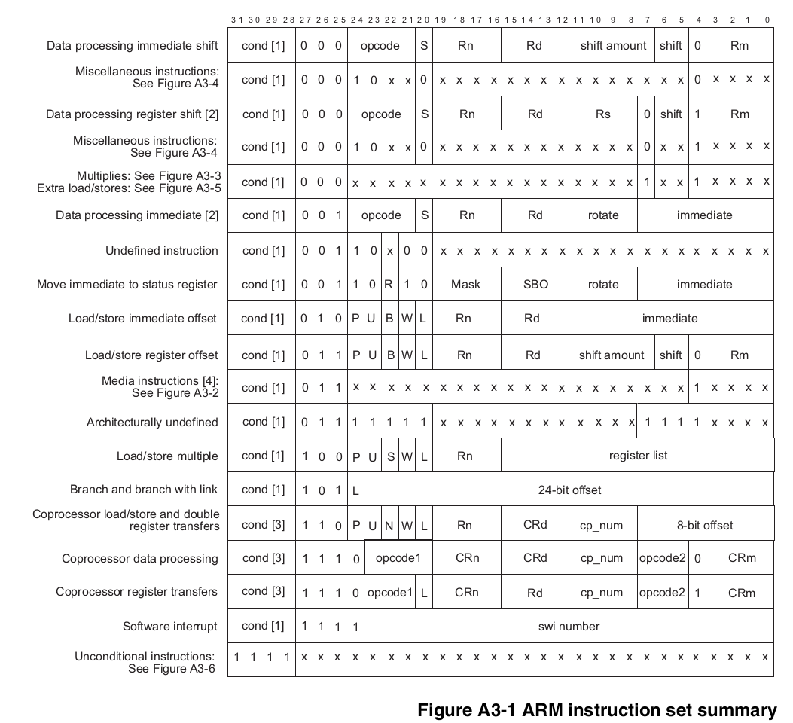
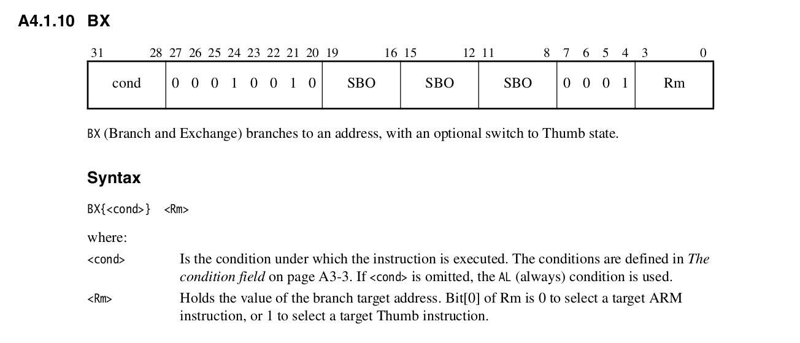
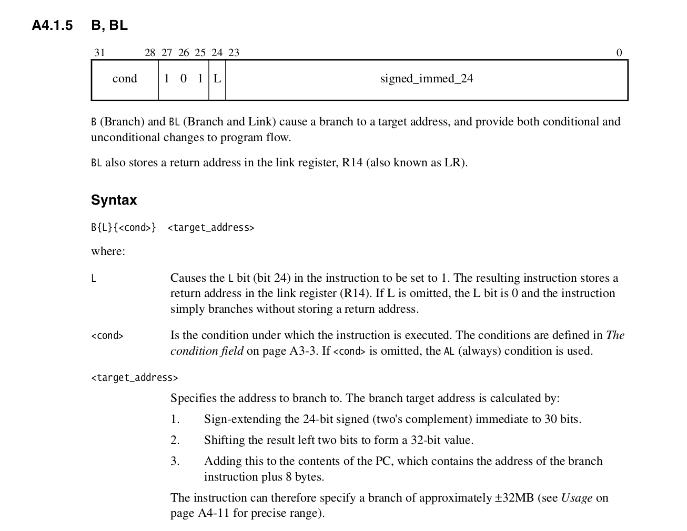

## Lab: machine code tricks: jits, self-modifying, reverse engineering.

Today we'll hack machine code.  It's a great way to get a concrete,
no-bullshit view of how hardware actually works.  It also let's you do
cool tricks not possible within high level code.

Machine code is the integers used to encode machine instructions.  It's
even lower-level than even assembly, which at least is character strings.
For example, the assembly for our `GET32` which loads from an address
and returns the value looks like:

        @ libpi/staff-start.S
        GET32:
            ldr r0,[r0]     @ load address held in r0 into r0
            bx lr           @ return

Whereas if you disassemble the executable (`arm-none-eabi-objdump -d`)
you can see the machine code is two 32-bit integers:

            0xe5900000  #  ldr r0,[r0] 
            0xe12fff1e  #  bx lr 

It's easy to set the wrong bit in machine code, which can completely
transform the meaning of the instruction or, only slightly change it,
so it uses the wrong register or wrong memory address, birthing wildly
difficult bugs.

With that said, generating machine code is fun, kind of sleazy, and
most people have no idea how to do it.  So it makes sense as a lab for
our class.

As discussed in the `PRELAB` it's used for many things, from the original
VMware, machine simulators (closely related!), JIT compilers you may
well use everyday, and even nested functions in gcc.

A second nice thing about generating machine code is that it really
gives you a feel for how the machine actually operates.  When you do
today's lab you will realize that --- surprisingly --- assembly code is
actually high-level in many ways(!) since the assembler and linker do many
tricky things for you.  (E.g., linking jumps to their destinations.)
You will implement a bunch of these things (next lab).

The theory behind today's lab is that we'll do concrete examples of a
bunch of different things so that it removes a bunch of the mystery.
Subsequent lab will go more in depth, where you can build out the things
you do today.

We'll do a bunch of simple examples that show how to exploit both
runtime machine code generation or self-modifying to get speed or 
expressivity.

### Checkoff

If you've never done this lab before:
  - Do 1-3.
  - Do something interesting over the weekend.  It can be an extension
    or just something cute you think of.

If you did this lab as an extension in 140e:
  - Do at least two of the extensions at the end.
  - Do something interesting over the weekend.  It can be an extension
    or just something cute you think of.

----------------------------------------------------------------------------
### Part 0: Getting started.

The first barrier to generating machine code is to wrap your head
around specifying it.  As a quick hack, write code that genenerates a
routine that returns a small constant.

The easy way to do this:
  1. Write a routine that returns the constant as C code.
  2. Compile the file its in.
  3. Look at the associated `.list` file or generate it yourself 
     using `arm-none-eabi-objdump -d`.
  4. Put the 32-bit constants for the executable code in an array.
  5. Cast the array to a function point and call it.

The prelab pi code has an example: `prelab-code-pi/0-ident-dcg.c`

----------------------------------------------------------------------------
### Part 1: write a `hello world`

Generate a routine to call `printk("hello world\n")` and return.
  - `code/1-hello` has the starter code.

The quick and dirty way to do this:
  1. Write a C routine to call `printk` statically and return.
  2. Look at the disassembly.
  3. Implement the code to generate those functions.  I would suggest
     by using the cheating approach in `code/examples`.  

I'd suggest writing routines to generate relative branching (both with
and without linking):

    // <src_addr> is where the call is and <target_addr> is where you want
    // to go.
    uint32_t arm_b(uint32_t src_addr, uint32_t target_addr);
    uint32_t arm_bl(uint32_t src_addr, uint32_t target_addr);

All the instruction encodings are in the ARMv6 architecture manual 
(`cs240lx-25/docs/armv6.pdf`).  We excerpt that chapter for simplicity
as `docs/armv6-inst-full.pdf`

#### A3-2: ARM instruction encodings

Chapter 3, page 2 of the armv manual has all the encodings.

  

#### A4-20: bx instruction

  

#### A4-10: bl instruction

  

--------------------------------------------------------------------------
### Part 2: add executable headers in a backwards compatible way.

Even the ability to stick a tiny bit of executable code in a random place
can give you a nice way to solve problems.  For this part, we use it to
solve a nagging problem we had from `cs140e`.

As you might recall, whenever we wanted to add a header to our pi
binaries, we had to hack on the pi-side bootloader code and sometimes
the unix-side code.  Which was annoying.

However, with a simple hack we could have avoided all of this:  if you
have a header for (say) 64 bytes then:

   1. As the first word in the header (which is the first word of the
      pi binary), put the 32-bit value for a ARMv6 branch (`b`)
      instruction that jumps over the header.

   2. Add whatever other stuff you want to the header in the other
      60 bytes: make sure you don't add more than 64-bytes and that you
      pad up to 64 bytes if you do less.

   3. When you run the code, it should work with the old bootloader.

      It's neat that the ability to write a single jump instruction
      gives you the ability to add an arbitrary header to code and have
      it work transparently in a backwards-compatible way.

More detailed:
   1. Write a new linker script that modifies `./memmap`  to have a header
      etc.  
        - You should store the string `hello` along with a 0 terminator
          in the header right after the jump instruction.
        - You should also define a label (e.g., `__hello_string__`)
          in the header right before the string that the C code can reference.

   2. Modify `2-jump/hello.c` to set a pointer to the label from (1).
      The code should run and print it.

   3. For some quick examples of things you can do in these scripts
      you may want to look at the `2-jump/memmap.header` or
      `2-jump/memmap.header` linker scripts from old labs.  The linker
      script language is pretty bad, so if you get confused, it's their
      fault, not yours --- keep going, try google, etc.     We don't
      need much for this lab's script, so it shouldn't be too bad.

   4. To debug, definitely look at the `hello.list` to see what is
      going on.

   5. [linker script example](https://interrupt.memfault.com/blog/how-to-write-linker-scripts-for-firmware)

--------------------------------------------------------------------------
### Part 3: make an interrupt dispatch compiler.

We now do a small, but useful OS-specific hack.  In "real" OSes you
often have an array holding interrupt handlers to call when you get an
interrupt.  This lets you dynamically register new handlers, but adds
extra overhead of traversing the array and doing (likely mis-predicted)
indirect function calls.  If you are trying to make very low-latency
interrupts --- as we will need when we start doing trap-based code
monitoring --- then it would be nice to get rid of this overhead.

We will use dynamic code generation to do so.  You should write an
`int_compile` routine that, given a vector of handlers, generates a
single trampoline routine that does hard-coded calls to each of these
in turn.  This will involve:
  1. Saving and restoring the `lr` and doing `bl` as you did in the 
     `hello` example.
  2. As a hack, you pop the `lr` before the last call and do a
     raw branch `b` to the last routine rather than a branch and 
     link `bl`.  That way the last routine will return all the way
     back to the caller (saving one jump).

#### Advanced: jump threading 

To make it even faster you can do "jump threading" where instead of the
interrupt routines returning back into the trampoline, they directly
jump to the next one.  For today, we will do this in a very sleazy way,
using self-modifying code.

Assume we want to call:

    int0();
    int1();
    int2();

We:
   1. Iterate over the instructions in `int0` until we find a `bx lr`.
   2. Compute the `b` instruction we would do to jump from that location
      in the code to `int1`.
   3. Overwrite `int0``s `bx lr` with that value.
   4. Do a similar process for `int1`.
   5. Leave `int2` as-is so it turns back to the original caller.   

Now, some issues:
  1. We can no longer call `int0`, `int1` and `int2`  because we've modified
     the executable and they now behave differently.
  2. The code might have have multiple `bx lr` calls or might have data
     in it that looked like it when it should not have.  For today
     we just hope and pray, but that's not a acceptable strategy in general.
  3. If we use the instruction cache, we better make sure to flush it or at 
     least the address range of the code.

There are hacks to get around (1) and (2) but for expediency we just
declare success, at least for this lab.

----------------------------------------------------------------------------
### Part 4: Runtime inlining `4-runtime-inline`

Modern C compilers generally only inline routines that are in the same
file (or included header file).  And even then they may only do it if it
the definition appears before the use.

Because of heavy use of seperate compilation, many routines that could
be usefully inlined cannot, because their implementations are not known
until all the `.o` files are linked together.  When I was a kid, there
were various link-time optimizers (OM from David Wall was great) but now,
they are rare.

If you know machine code, you can write your own runtime inliner.
We'll build a simple proof of concept that works by providing special
versions of GET32 and PUT32 that can reach back into their caller and
rewrite the callsite (the branch and link instruction that calls them).

These code has two parts:

  1. `runtime-inline-asm.S`: Assembly code for special versions of PUT32
     and GET32 (`PUT32_inline` and `GET32_inline`) that get inlined if
     the client calls them.  We initially only inline these routines so
     that its easier to debug.

     These routines call a corresponding C code handler
     (`PUT32_inline_helper` and `GET32_inline_helper`) with the return
     address of the caller.  

  2. `runtime-inline.c`: C-code handlers that do the actual rewriting.

What you need for PUT32:
  1. Machine code to do a store.  From the original machine code:

            00008024 <PUT32>:
                8024:   e5801000    str r1, [r0]
                8028:   e12fff1e    bx  lr

     Thus, the store is `0xe5801000`.  

  2. So, given the address of the call instruction (`lr` holds 4 bytes past this) 
     we can overwrite the original call instruction with the store.

Why this works:
  1. The store instruction takes as much space as the call instruction
     so we can replace it without expanding or contracting the program binary.
     The fact we don't dilate the binary is a *huge* simplification!
  2. We know `r0` and `r1` hold the right values at this program address, because 
     otherwise the call wouldn't work.
  3. We don't have the icache or dcache on, so we don't need to manually 
     synchronize them.

Similar logic holds for `GET32`.

The test code will run with and without the modification and measures the 
performance improvement for a trivial program.

Some tradeoffs:
  1. We get a speedup.
  2. However, we get less of a speedup than if we inlined at C source code level
     since the compiler could potentially specialize the code further.

Extension: specialize GPIO routines
  1. We needed to do this inlining at runtime since we don't have a
     reliable way to tell code from data and so cannot simply walk over
     the `.bin` file replacing all calls.

  2. However, we can specialize a function definition  since we can find the
     funtion entry point from the elf file and we know its semantics. 
  
  3. So go in the binary and smash different gpio routines, eliminating
     if-statement checks and inlining the GET32 and PUT32 calls.

  4. There are extra three co-processor register registers you can store 
     large constants in to eliminate the cache hit from loading them from
     memory (gcc's preferred method).

--------------------------------------------------------------------------
### Part 5: make a jitter for dot-product.

Given a sparse vector, generate custom dot product code that hard-codes
the given vectors non-zero values in the instruction stream.

This was the first piece of code I ever wrote that led to publication.
It's fun.  
   1. For each unit test in `armv6-encodings` implement the needed
      instruction.

   2. Write the code in `5-jit-dot` to encode a dot product in the 
      instruction stream, skipping zeros.  

----------------------------------------------------------------------------
### Extensions

There are a ton of extensions.  You're more than welcome to think of your
own, ideally where you make something fast for another class or personal
project.

#### Redo the lab to generate the code on your laptop.  

You'll learn alot.  On Mac that can run ARM it's not too hard.
For x86 it can be painful, but eye opening --- x86 is why
I built a reverse engineering approach that figured out 
instruction encodings from the assembler (we'll build this next lab).

You will likely require defeating exploit-proofing the OS has put in place
(e.g., disallowing executing heap memory).  The `prelab-code-unix` 
has an exmaple of how to do so on Linux.

Even better: make a fake little RISC language (you can look at the
vcode paper) and have two backends: one that JITs to your laptop,
one that JITs to the pi.

#### Redo our 140e "full-except" code to be fast.

This is the most immediately useful extension.

If you recall our 140e exception code let the client override
exception handlers at runtime by using function pointers.  This 
approach is slow, requiring several loads and an indirect jump
that likely gets mispredicted.  You can use your jit knowledge
to generate code that jumps directly to the client routine without
this intermediate code.

For this, I would make a copy of one of the single step  equivalance
labs and use this approach --- their hashing should detect if 
there was a bug.  You can then just start tuning the exception
handling like crazy.  We did it in a pretty dumb way: I wouldn't
be suprised if you could get at least 5x speedup.

#### Use the armv6 performance counters.

Implement a veneer for the performance monitoring unit on the
arm1176 (this is 3-133 to 3-138) and use this to determine 
why exactly you are getting speedups.

#### Add caching and cache coherence

Right now we assume the data and instruction cache aren't on, so 
we don't do any coherence.  Adding dumb coherence where
we invalidate both after modifying code is pretty simple --- you 
can use routines from the 140e ("vm coherence") lab 15.  However,
it is slow: you can also use the more precise instructions to just
invalidate a range of addresses to be more efficient.

####  Make a precise profiler using dynamic inlining

In 140e we built a gprof profiler.  While easy, it was statistical 
(so not exact) and also didn't give any indication of who was calling
the expensive routines.  You can use the hacks from 
dynamic inlining to build an exact, callstack preserving profiler
as follows:
   1. Get the list of routines in the executable (using nm) and append
      it to the binary.
   2. Go through this list and rewrite the first instruction of each
      routine to call a rewriting trampoline that will fabricate
      a call to the original as well as updating a data structure
      with the current caller and cycle count.

It should be pretty cool, but there are some details, so let us know
if you do this.

####  Make a hot patch utility

For many long running programs (telephony exchanges, crucial servers,
satellites hurtling through space) you can't bring them down / reboot
to fix but instead may need to dynamically patch them.   Live patching
is fun and exposes a bunch of low level details that can be interesting,
so make a simple version!

As a trivial version, you can include a simple machine code patch in your
program (e.g., as an array), and when something triggers it (e.g., an
input, timer interrupt, bug) smash the original code to call your patch.

You can probably figure out a more cute approach :)

####  Make a hot measurement system

Peter Deustch and C.A Grant made an outragously fun tool in
1971 that let users *safely* attach machine code monitors to
a running kernel.   I don't know anyone that has done this in
decades  --- you can build a simple version.  The paper is in
[docs/deutsch-measurement.pdf](docs/deutsch-measurement.pdf).

This isn't useless:  Linux uses a more limited, mundane version of this
approach (eBPF) by extending the BPF packet filter language.

####  Make a small back-end jitter

Web assembly JIT: There are C compilers that spit out web assembly ---
a stack-based low-level "portable assembly language".  You can write
an interpreter for a small subset pretty easily.  And once you do this,
you can write a JIT for this subset.  You should be able to easily get
10x speedup --- more if you do clever tricks to get rid of the stack
operations.  Very useful!

eBPF/BPF jit: the BPF (or extended BPF) language is pretty small and
widely used.  BPF for packet filtering (deciding for a given packet,
which flow gets it), eBPF for linux performance monitoring.  Like web
assembly BPF is stack based and slow to interpret.  You can make a JIT
for without heroic effort that should give 10x or more.  
Widely used, good to know, neat to do.

####  Compile a neural net to code

#### Alot more!

There's various other hacks you can do; let us know if you need them!

