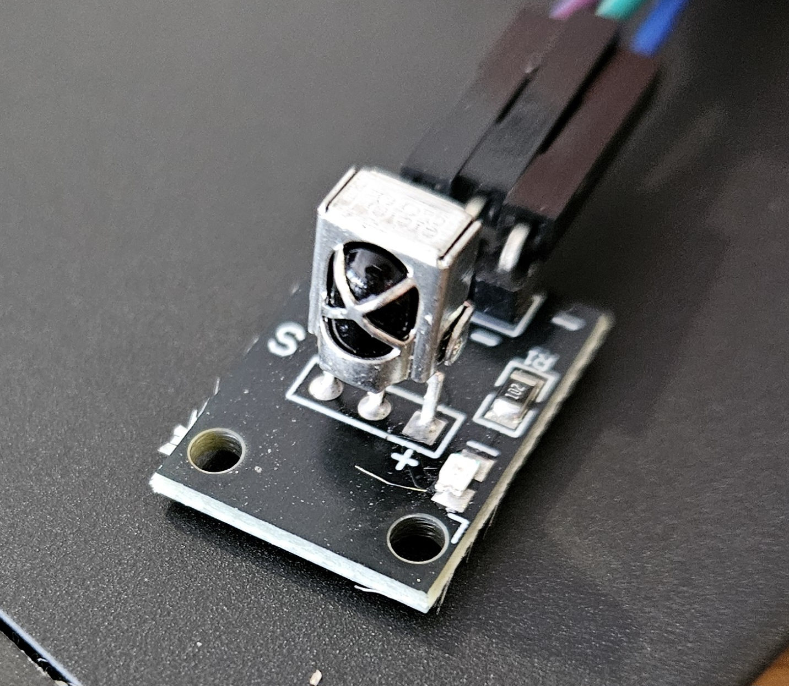
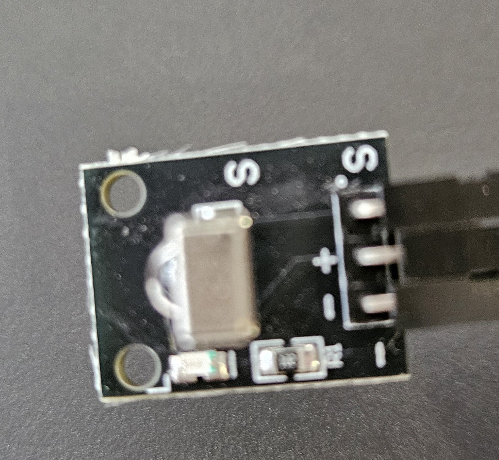

### Overview: reverse engineering a infrared remote control.

  

Today is a fun reverse engineering lab.   
  1. Using an IR sensor --- [the Vishay TSOP4838](https://www.newark.com/webapp/wcs/stores/servlet/ProductDisplay?catalogId=15003&productSeoURL=vishay&partNumber=60K6999) --- you'll reverse engineer the key presses from a remote.  It's a fun puzzle that doesn't need much infrastructure.  Many projects you do get better if you can add remote control, so it's also useful.

  2. You'll then use an LED to transmit values the IR receiver can read.
     You'll use this to make a simple network that implements the UART
     protocol to send bytes.  Open ended, illuminating puzzles: (1)
     how fast can you send UART characters, (2) make a network bootloader.
    
     Loop-back is an interesting example: it's extremely sensitive to mistakes,
     which keeps you honest, and can be used as a simple "hello world" to 
     show the tradeoffs of the different ways to structure systems: interrupt
     based, threads, events.  We will likely do this on thursday.

As with the last lab, it should be easy to ignore all of our code if
you want, and just do everything from scratch ("Daniel mode").

Where stuff is:

  - The IR receiver datasheet is in `docs/tsop4838.pdf`.
    You should read this to make sure (1) you know which pins to connect
    to and (2) what min and max power they expect.

  - The IR led datasheet (for part 2) is `docs/tsal4400.pdf`.  The main
    rule: we do not use a resistor and the LED is tiny, so never leave
    it on for long, and never ever plug directly into 3v.  (Definitely
    not 5v.)

  - The starter code is in `code/0-dump-driver.c`.

  - We have remotes.  Note that after you get them working,
    you should be able to download a "universal remote" app on your phone
    and also use that.  A cool side-effect is having the infrastructure
    to control your pi from your phone.

    Note: many (most?) remote apps suck, so it makes sense to poke around
    on reddit or stackoverflow for a simple one.

*The single most common major mistake*:

  - Do not print values *while* recording times, since doing so will
    mess up your timings.  Instead when the IR has been low for "a long
    time", print all the timings you've seen.

Background: If you haven't had 140e: you should go through the labs:
  - [GPIO](https://github.com/dddrrreee/cs140e-24win/tree/main/labs/3-gpio)
  - [Interrupts](https://github.com/dddrrreee/cs140e-24win/tree/main/labs/5-interrupts)
  - [Threads](https://github.com/dddrrreee/cs140e-24win/tree/main/labs/6-threads)
     
### Checkoff

Checkoff:
  1. You should consistently be able to print "LEFT", "RIGHT",
     "UP", "DOWN", "OK", "*" and "#" when you press the remote.
  2. You should do some kind of extension.  (Easiest is to use
     interrupts).

--------------------------------------------------------------------
### Background: how an IR remote sends values

Optional background reading:
 - [A nice clear writeup of IR protocol](http://irq5.io/2012/07/27/infrared-remote-control-protocols-part-1/)

IR remotes send a "0" or "1" bit by switching their internal
LEDs (causing the receiver to go to 0) for differing amounts of time.
They seperate each "0" or "1" by not transmitting for a fixed amount
of time.     A specific remote button will have a unique, consistent
integer formed by contatentating the "0" and "1" bits transmitted (in a
manner similar to how we did the UART protocol).  The bits for a given
command are prefixed by a header that lasts much longer a single bit and
similarly, ended by not transmitting a relatively long amount of time.

The approximate timings for the black DWEII remote I used (all times
in microseconds):

        Signal   |  signal, IR=0    |  no signal, IR=1 
         HEADER  |    9000          |  4500
         0 bit   |     600          |  600
         1 bit   |     600          |  1600
         STOP    |     600          |   --

Notes:
  - IR=0 denotes that a read of the IR signal GPIO pin is 0
    (`gpio_read(signal)=0`) and IR=1 denotes the read of the IR signal
    pin is 1 (`gpio_read(signal)=1`).

  - Easy confusion: Recall that that by default IR=1 when there is no
    signal, IR=0 and 0 when there is (i.e., receiver saw a long-enough
    signal at 38kHz).

  - It appears they indicate the end of a transmission by
    not signaling (so: IR=1) for about 40,000 usec.
  - Sometimes remotes send different values for a "short press" and
    a "long press" of a button.  You'll have to test this yourself
    by pressing quickly and slowly.

So to send "01" a transmitter would:
    0. Send a header: transmit (so: IR=0) for 9000 usec, then 
       nothing (IR=1) for 4500 usec.
    1. Send a "0": Transmit (IR=0) for 600 usec, then don't transmit 
       (IR=1) for 600 usec.
    2. Send a "1": Transmit (IR=0) for 600 usec, then don't transmit 
       (IR=1) for 1600usec.
    3. Send STOP: Transmit (IR=0) for 600usec, then don't transmit (IR=1) 
       for a "long" time as compared to "0" and "1".

So given this information you should be able to reverse engineer the
value for each key.

A simple-minded algorithm:
  1. Spin waiting until you read 0 from the IR (IR=0 implies there 
     was a signal).
  2. If we get a header (IR=0 for 9000, IR=1 for 4500)
       - then read bits until we timeout (set this longer than 
         any legal value -- I used 20000).
     Else iff the readings don't match a header, goto (1).
  3. reconstruct the signal by converting IR readings to a 1 or 0
     as follows:
       - 0 = IR=0 for 600us, IR=1 for 600usec.
       - 1 = IR=0 for 600us, IR=1 for 1600usec.
     And shifting the value into a "large enough" unsigned integer. (For us:
     32-bits.)  

     Note, the order doesn't matter as long as you're consistent 
     since it's just an internal integer.

This process should remind you of UART read.  And, as with UART, there
will always be timing error, so your code has to handle with 
uncertainty it introduces.

  1. I accepted readings as a valid header if they
     were within 10% of the expected value.  So: a first reading IR=0
     for 9000 +/- 900usec, followed by IR=1 for 4500 +/- 450usec.

  2. When deciding if a value is a skip, return true if it's within
     a given number of usec (e.g., if its between 400 to 800usec).

  3. When deciding if transmission was a "1" or a "0", pick the value by
     deciding if its above or below the halfway point between the two
     values 600 and 1600.  I.e., if the timing is above (1600+600)/2 then 
     it's a 1 and is a 0 otherwise.  
 
     Midpoint is fairly robust and though sleazy (since it won't reject
     anything) is close to what alot of hardware does (according to
     Mark H).

  4. If you are more clever than this somewhat brain-dead approach,
     be more clever!

To repeat some common problems:
  - Again, don't print while reading or you'll get garbage timings.
  - Some remotes send different values for "long" or "short" keypresses.
    You'll have to experiment.

--------------------------------------------------------------------
### Crucial

  - I cheaped out and bought some low quality remotes on amazon that came
    with IR sensors.  These are the HX1838 rather than the Visha TSOP4838
    assumed in the README, but the behavior seems roughly the same:
    both expect a 38Khz signal, both need their signal pin to set as
    a pullup.  With that said, I'm not sure about their envelop in terms
    of maximum number of transitions per second, minimum gap between
    transitions, etc.  The most professional datasheet I saw after a
    indifferent search is in [docs/HX1838.pdf](docs/HX1838.pdf).

    The HX1838 has a nice feature that its on-board LED will flash red
    when it gets a signal.  While it makes the sensor more bulky it's
    a great way to tell if you are getting environmental interference.
    When I was at bytes cafe earlier, I had zero interference.  When
    waiting for class near coupa, I had tons of IR interference --- to
    the point that I had to shield the IR receiver with my hand to 
    check the lab code or it would fail immediately with extraneous
    readings!

  - Related, we have two different remotes that will have different
    signals:  the silver JUZITAO remotes and the black DWEII remotes. You
    should reverse engineer for the one you get.  (Ideally, do both and
    parameterize the routines so you can easily handle multiple remotes.)

  - The HX1838 and TSOP4838 both expect a 38Khz signal.  There are other
    frequencies in common use (e.g., 40Khz, 36Khz).  This means that if
    you grab a random remote it may well not work with a given IR sensor.
    It also means that you have to pay attention to the required frequency
    when you do transmit with an IR led.

  - Unlike the human eye, which detects visible light from regular
    LEDs in a simple way --- seeing light when the LED is on and no
    light when it’s off --- IR receivers detect infrared light using
    a more compilicated way to avoid interference from environmental
    light sources.  In IR remote control systems, the IR LED (transmitter)
    emits light that is modulated, or switched on and off, at a specific
    frequency, such as 38 kHz. The IR receiver is designed to detect only
    this modulated signal, ignoring unmodulated IR light from sources
    like sunlight or other devices. Many IR systems also use specific
    burst durations in their signals, which further reduces the chance
    of false triggers from random noise. While these techniques make
    interference unlikely, it’s not impossible, especially if multiple
    IR devices are operating nearby.

    You can use this wavelength specificity to your advantage by using
    (or building?) IR receivers with unusual frequencies.

  - IR sensors drive their output to 0 when they get a signal.  Thus,
    you need to set the GPIO pin used to read the signal as a pullup so
    that by default the pin is 1 rather than floating or 0.

    This default state can be used to detect some connection mistakes:
    read back the signal GPIO pin and make check that it is 1!  Some (but
    not all) misconnection errors will cause the read to be 0.

  - Related: more than usual, pay attention to the temperature of your
    IR receiver after connecting.  If it's hot, DISCONNECT!  You should
    check this.  It's easy to incorrectly connect to the output pins
    and get a short.  This happened to me b/c the first picture that
    came up when searching for the HX1838 has different pinout than the
    given breakout board.

--------------------------------------------------------------------
### Part 0: hook up code and make sure you get output.

Hook up the IR to your pi.
  1. S: the signal pin of the IR should be to pin 21.
  2. +: the power should be to 3v.
  3. -: ground.

For the HX1838 make sure you look for the "S", "+", and "-" symbols on
the breakout board:

  
  

The starter code is in `code/0-dump-driver.c`.  It records and prints
transitions.  You can use this as a starting point to reverse engineer
the key presses.

After hooking up the hardware:
  - run the code

        % cd code
        % make

  - Press the keys and see that you get some output.
  - If not, make sure your IR isn't hooked up wrong!
  - Look at the output and make sure you understand what is going on.

----------------------------------------------------------------
#  Part 1: reverse engineering key presses

Given the protocol described above, you should be able to reverse engineer the
value `v` for each key.  
  - The goal: If you hit the same remote key over and over, you should 
    get the same value.

What to do:
  - Make a new file by copying `0-dump-driver.c` (or just start from 
    scratch).
  - Start reverse engineering your remote's key presses.
  - Checkoff: you should consistently be able to print "LEFT", "RIGHT",
    "UP", "DOWN", "OK", "*" and "#" when you press the remote.

Check (and abort if the check fails):
  - Header should be within acceptable limits.
  - For 0 and 1: The transmit (IR=0) should be within an acceptable limit.
    The no-transmit: within an acceptable limit plus use the midpoint
    to resolve whether its 0 or 1.

NOTES:
   1. As we found in the early timing labs, if you print something
      while you are waiting for a time-based signal, the print will
      likely take long enough that you miss it or corrupt the timing.

   2. As mentioned before, since the timer on the pi is a different
      device than GPIO, you'd have to use a memory barrier to synchronize
      them.  To avoid this, you might want to use the pi's cycle counter
      (which doesn't need a memory barrier).  Of course, this can overflow
      pretty quickly, so make sure your code does not get confused.

----------------------------------------------------------------
###  Extension: smoothly control a light.

***IF YOU GET HERE DO A PULL: AM ADDING STUFF***

If you have a remote control, you'd probably want it to control something.
So for this extension, do so.

The trick here is that if you look at the TSOP code it has a bad tendency
to block everything else while it spins in a loop waiting for input.
This didn't matter for our keypress printing since printing wasn't
timing sensitive.  However, even something as simple as PWM-ing an LED
can go awry without care:

  1. You can't sit in a loop waiting for the complete IR signal b/c     
     you won't be turning the LED on-off.
  2. You can't blindly sit turning an LED on-off b/c then you may well
     be ignore IR input.

There's a variety of ways to solve this.  Most people spastically grab
one (e.g., interrupts) not thinking about how it exponentially explodes 
the number of paths in code, essentially making it untestable.

A few different options:

  1. Have the IR code run in a loop, and the PWM code run in a timer
     interrupt handler.  Easy to describe.   Not that hard to setup.
     Downside: can't test the code thoroughly, you do need the interrupt
     to run fast enough or you can miss IR input.

  2. Use hardware to PWM --- you can view this as having a second thread
     that happens to run on a hardware device.  The pi has a PWM 
     device that allows this.  Downside: datasheet is not great.

  3. Use cooperative threads: Each time the IR or the LED does a delay,
     yield to the other thread.  Advantages: less paths than the interrupt
     code.  The thread context switching cost (and time between yields)
     is a hard limit on how fine your accuracy can be.

  4. Use a run-to-completion thread (a function call with state) for
     the PWM code.  This routine is called whenever the IR code does
     a delay (i.e., in each place it would call yield for threads).
     The IR code just spins in a loop.  Downside: not very flexible.
     However, it uses the least amount of machinery (no assembly, no
     interrupts, no datasheets other than for IR).  I have a soft
     spot for doing this kind of thing since it's basically one
     big sequential program.

No matter what you do, you should record the time between when your
code runs and flag if it ever exceeeds some threadshold.

----------------------------------------------------------------
# Extension: IR interrupts.

***IF YOU GET HERE DO A PULL: AM ADDING***

In general, if we use remotes its to very-occasionally control a device
that is pretty busy doing something else.  In this case, it's natural
to use interrupts (note: this is hard if we care about very fine timing;
there are other approaches).

If you need a refresher:
  - lab 8 in cs140e goes over GPIO interrupts.
  - I checked in a staff version `staff-objs/gpio-int.o` that you can link in
    (by modifying `put-your-src-here.mk`) and use.
  - If you have it, you can also use your own code.

The relevant functions:

    // include/gpio.h

    // p97 set to detect rising edge (0->1) on <pin>.
    // as the broadcom doc states, it  detects by sampling based on the clock.
    // it looks for "011" (low, hi, hi) to suppress noise.  i.e., its triggered only
    // *after* a 1 reading has been sampled twice, so there will be delay.
    // if you want lower latency, you should us async rising edge (p99)
    void gpio_int_rising_edge(unsigned pin);

    // p98: detect falling edge (1->0).  sampled using the system clock.
    // similarly to rising edge detection, it suppresses noise by looking for
    // "100" --- i.e., is triggered after two readings of "0" and so the
    // interrupt is delayed two clock cycles.   if you want  lower latency,
    // you should use async falling edge. (p99)
    void gpio_int_falling_edge(unsigned pin);

    // p96: a 1<<pin is set in EVENT_DETECT if <pin> triggered an interrupt.
    // if you configure multiple events to lead to interrupts, you will have to
    // read the pin to determine which caused it.
    int gpio_event_detected(unsigned pin);

    // p96: have to write a 1 to the pin to clear the event.
    void gpio_event_clear(unsigned pin);

Simple strategy:
   1. enable rising edge (from 0 to 1).
   2. In the interrupt handler, just process the entire remote transmission.
   3. This locks up the pi during this, but in the case that you are going to
      do a major phase shift, this is ok.

A possibly better strategy:
   1. Detect each edge and put the result in a queue.
   2. When you detect a stop, convert the edges to a value.
   3. This is more complicated, but lets you spend not-much time in the handler.

