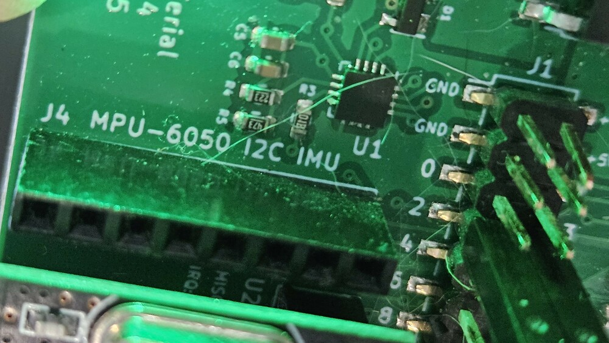
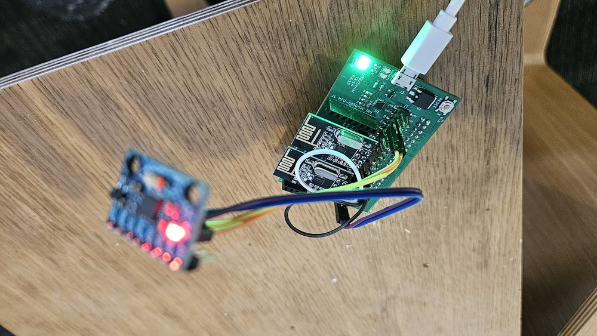

## Using an i2c mems-based IMU (accelerometer + gyroscope)

  

Today we're going to communicate with the InvenSense MPU-6050
accelerometer + gyroscope using the I2C protocol.  Inertial measruement
units  (IMUs) are useful for measuring and controlling stuff based
on motion.  (E.g., gesture-based device control, step counting,  sports
movement tracking, movement reactive light shows, etc.)

Why:
 1. The code isn't complicated, and is a good break from debugging
    lower level stuff.
 2. Doing different devices is a good good basis for final projects.  
 3. The exact lab today can be used as a cheat code in other classes
    that have final projects --- e.g., just do what Tina did and 
    add an accel to your ai project (about 10 minutes) and immediately
    stand out from the other few hundred students.
 4. I2c is common, so it's good to get experience.  It's also 
    good to get practice with another device.

The plan is to:
  1. Write the 6050 device driver to configure and use the accelerometer
     using an i2c driver we give you.
  2. Write your own i2c driver from the Broadcom documents in a subsequent
     lab.

There are a ton of extensions.   Literally tons.  Many I wish I had
time to do, so with modest effort you can crank my boomer envy to 11.
(In my ideal world people go off and figure out how to do different
tricks and then do a show-and-tell next lab as a follow on.)
  - If you're interested in this topic, we have several more advanced
    MPU's --- the InvenSenses MPU9250 and Polou's MiniMPU v5 --- both of
    which have a magnetometer.  Extension: If you're interested in this
    type of device, we also have a more expensive 9-axis InvenSense's
    MPU-9250 and Polou's MiniMPU v5 (both about $20-25) that you can
    do for the lab or for an extension.  They include a magnetometer so
    you can do correction.

    In technical slang, these are called 9-axis DoF (degree of freedom)
    devices  --- 3-axis for the X, Y, Z accelerometer + 3-axis for the
    gyro + 3-axis for the magnetometer.  Porting your code to these
    is a good way to make it obvious what are the common things to do,
    and whats device-specific.

The `docs` directory has a bunch of documents.  The two main ones for
the MPU-6050:
  - [MPU-6050-reg-map.pdf](./docs/MPU-6050-reg-map.pdf): 
    The different device "registers" used to initialize and get readings.
  - [MPU-6050-spec.pdf](./docs/MPU-6050-spec.pdf): The device description that 
    gives a more general device overview along with self-test and startup delays.
  - [Broadcom-i2c.pdf](./docs/broadcom-i2c.pdf): excerpted broadcom I2c.

Some other documents in no particular order:
  - [A nice clear SPARKFUN tutorial on gyros](https://learn.sparkfun.com/tutorials/gyroscope/all).
  - [MPU6050 overview](https://mjwhite8119.github.io/Robots/mpu6050).

#### Checkoff

 - You should implement the `todo` parts of `code/mpu-6050.c` and
   make sure that both `driver-accel.c` and `driver-gyro.c` give
   reasonable answers.

 - Implement some kind of extension.  
    - A trivial one is getting the temperature.  Compare it with
      the pi temperature (obtained using the mailbox).
    - A cool one that Joseph and Yash did last year was doing the step 
      counter (I believe using the motion detection p 39, but check
      with Joseph!).  
    - A standard, useful one would be to add interrupts and put the 
      readings in a circular queue (p 27-29 of the register map).  
    - A useful one would be figuring out how to use the self-test.
    - A fun one is using the IMU to control pixels on a small screen.
      E.g., to make a game controller.  We have some small screens.
    - An adult one is to do the 9250 or Polou IMU.
    - An OS one is to write your own I2C driver --- if you do this
      let us know, since there are some pointers.

Alternatively, you can just do hard (Daniel) mode:
 - You can easily ignore our starter code and write everything from
   scratch.  The needed interface is narrow (reset, initialize, has-data,
   read-data) without any datastructures.  It's an interesting exercise.
---------------------------------------------------------------------------
### Incomplete cheat sheet of page numbers.

The overall view of the device (`docs/MPU-6050-spec.pdf`): 
  - p7: 6050 only supports I2C (not SPI).
  - p10: overview of gyro and accel specs.  accel can eat a 10000g impulse ok.
  - p12/p13: useful distilled values for settings.
  - p12: self test difference from factory trim: -14% (min) to 14% (max).
  - p14: max voltage: 3.46v max (don't use 5v!).  2.375v min.
  - p14: "ramp rate": 100ms.  unclear if needed but we wait 100ms
    for device startup or reset.
  - p15: i2c addresses.  (0b1101000 or 0b1101001).
  - p15: i2c frequency (400khz fast mode, 100khz standard).
  - p27: has a self test.  configure it!
  
Note:
  - In general we can skip the external device reading (we
    don't have any connected) and the master/slave discussion.

For today, we want to figure out how to:
  1. Reset anything that we can back to a known state: the device, the
     FIFO (can have garbage), signal paths --- anything else that could
     have weird values.
  2. How long we need to wait after reseting / powering up.
  3. Enable the accelerometer and gyroscope and set their datarate and 
     sensitivity.
  4. Know that data is available.

The register document (`docs/MPU-6050-reg-map.pdf`): what register to
read/write with what values:

  - p6-8: entire register map.
  - p8: reset values = 0 for everything but 
        power management (reg=107, val=0x40) and `WHO_AM_I` (reg=117, val=0x68)
  - p9: "the device will come up in sleep mode upon power up"
  - p9-12: self-test.  for many devices can't be sure the device is working,
    because we don't know what the right answer is.  so part of the data
    sheet adventure is searching around for different known answers and
    cross checking.  self-test values give us a way to make sure both that
    our code is correct and that the device isn't junk.  
  - p14: gyro configuration (reg= 0x1b or 27).   controls self-test and 
    the gyro sensitivity (degrees per second).
  - p15: accel configuration 1 (reg 28 or 0x1c) self test
        and accel sensitivity (2g min up to 16g max).
  - p16: FIFO enable (reg=35 or 0x23).
  - p19: i2c clock (the reset value 0 seems to = 348khz?)   possibly
    this is not relevant.
  - p28: interrupt enable and p29: interrupt status.
    I haven't used these but they are good because you can make sure
    you don't read stale data and don't miss anything.
  - p30-p31: accel readings (reg 59-64): you get a high byte and a low byte.
    make sure you combine these correctly!
  - p31: temperature (65 and 66).
  - p32: gyro output (regs=67-72, 0x43-0x48).  sensitivity set by `FS_SEL`
    (reg 27).
  - p38: reset signal path.  does not reset the sensor registers.  i think
    worth reseting during power up, but i think can do with "user control"
    (p40) below.
  - p38: motion control.  the DPM is proprietary so you'll have to look through
    git hub for how to use.
  - p40: "user control" that gives a bunch of things that can be reset:
    enable/disable/reset FIFO, signal reset.
  - p41: power managmement 1 (reg 107, 0x6b): use to reset the device, 
    configure stuff.  in theory: after reset starts in "sleep mode" so
    you have to turn that off!  difference from 6500.
  - p42: power management 2 (reg 108): used in low-power mode (which we don't).
  - p44: FIFO count registers (regs 0x72,0x73).
  - p45: read/write fifo (0x74): these are written in order of register 
    number from lowest to highest.  must check count before reading.
    (note: if devices produce values at different rates i'm not sure how
    to disambiguate the contents).  i've seen recommendations we should
    use the fifo to make sure we get a clean internally-consistent read
    of registers rather than some old and some new (if a reading comes
    in while extracting them).
  - p46: `WHO_AM_I` (117): use this to validate you can read from the
    chip and its responsive.

---------------------------------------------------------------------------
### Part 1: fill in the accelerometer code in the code directory.

Hook up the hardware:
   1. Either plug in your mpu-6050 into the Parthiv board directly 
      (header will have the same number of pins and the silkscreen
      will say "MPU 6050")

      

        
      

      

       
       
      

  2. Or use jumpers, which is a bit more complicated but lets you
     wave the MPU around easier.  The pins: SDA is gpio pin 2, 
     SCL is gpio pin 3, power should be 3v.

     

     
     

In either case: When the power is on, the red LED on the MPU should
light up

What to do now:
  1. Make sure that the staff code works.  When you run the
     `driver-accel.c` (the default in the Makefile). It should give
     *roughly* 1000mg or -1000mg readings for the different axis that
     are pointed to the ceiling.
  2. Look in the driver code `driver-accel.c` to see how it's calling
     the accel code.
  3. Look at the interface description in `mpu-6050.h`.
  4. Write the accel routines in `mpu-6050.c` and change the Makefile
     to use your code.
  5. Make sure that the results make sort-of sense.

Use the datasheet and application note from the docs directory.
There are notes in the code.

Note:
  - We use the "data ready" interrupt to see when new data is available.

    If you set the i2c speed low enough (by having a high i2c clock
    divisor) then this check will *never* fail because the speed is
    too slow.

    Our initial i2c implementation ignored clock-div and had this
    bug.  Interesting to track down since it's also consistent with
    misconfiguration.

---------------------------------------------------------------------------
### Part 2: fill in the gyroscope code in the code directory.

Similar to accel:
 1. Look at the readings from our code.
 2. Look at `driver-gyro.c`
 3. Look at the interface in `mpu-6050.h`.
 4. Write the gyro routines in `mpu-6050.c`.

Use the datasheet and application note.  Start with the simple cookbook
example they give and make sure your stuff looks reasonable!

---------------------------------------------------------------------------
### Extension: display the readings using your light strip or LED

The nice thing about the light strip is that you can do high-dimensional displays easily.
One dumb way:
   - give the accel half and the gyro half (or do not!  just map their coordinate system
     to the entire thing).
   - map the 3-d point of each reading to a location.
   - map the velocity of the point (or the accel, no pun) to a color.
   - display!

---------------------------------------------------------------------------
### Extension: write your own hardware or bit-banged i2c

The wikipedia for the i2c protocol gives a pretty easy pseudo-code you
can use to do a bit-banged version.

The broadcom document pages 28---36 describes the hardware i2c.

You'll notice that the i2c datasheet looks similar to UART
(fixed-size FIFO queue for transmit and receive, the need to check
if data or space is available, control over speed, errata, etc).
The more devices you do the more you'll notice they share common
patterns.  The nice thing: there exists an N s.t. after doing N
devices, doing N+1 is pretty quick.
---------------------------------------------------------------------------
### Extension: self test

A constant problem with devices checking if the output is garbage.
This can happen because the hardware is broken, it's a cheap counterfeit,
or (most likely) because our initial code is broken.  There usually isn't
any ground truth to compare to and broken devices (and broken code) may
not render the device inoperable, but instead just produce bogus values.
(A common one today: swapping the high and low bytes of the readings or
not sign extending.)

Fortunately, accel and gyros often have a "self-test" mode that can be
used to check for such problems.

The mpu 6050 register map document talks about self-test in Section 4
(page 9-12). Where you compare the readings obtained in self-test
mode to the "factory trim" and compute the percentage difference.

For the gyro (register map, p 10):
  1. Full-scale range should be +/- 250dps.
  2. You read the factory trim settings using registers 13-15 (p6) and
     using the low five bits (bit 0 to bit 4 inclusive) 

  3. You compute the percentage difference as follows:

         (Self-test - Factory Trim)
          -----------------------
               Factory Trim

  4. Acceptable is within +/- 14%.  Anything more than that is a reject.

 
---------------------------------------------------------------------------
### Extension: multiple devices + i2c

If you have your own i2c, you can easily hook up more than one device.
This is a good step towards a sensor glove or a wearable harness.

---------------------------------------------------------------------------
### Madgewick

The directory `example-madgewick` has some examples of using madgewick
calculations to determine position.

When you run it, you'll get something like:

        Time (s): 1.169999, roll: -3.184346, pitch: 3.179441, yaw: -0.88397
        Time (s): 1.179999, roll: -3.123109, pitch: 3.118479, yaw: -0.85033
        Time (s): 1.189999, roll: -3.184346, pitch: 3.179441, yaw: -0.88397
        Time (s): 1.199999, roll: -3.123109, pitch: 3.118479, yaw: -0.85033
        Time (s): 1.209999, roll: -3.184346, pitch: 3.179441, yaw: -0.88397
        Time (s): 1.220000, roll: -3.123109, pitch: 3.118479, yaw: -0.85033
        Time (s): 1.230000, roll: -3.184346, pitch: 3.179441, yaw: -0.88397
        Time (s): 1.240000, roll: -3.123109, pitch: 3.118479, yaw: -0.85033
        Time (s): 1.250000, roll: -3.184346, pitch: 3.179441, yaw: -0.88397

If you need floating point, look in: [../../guides/using-float](../../guides/using-float).

---------------------------------------------------------------------------
### Some Legit Extensions

If you finish, there's lots of tricks to play.  A major one is doing
correcton to the device errors.  The accel / gyro device is not that
accurate without correction.  This article discusses the issues and what
can be done (simply):

  - [Correct for hard-ion](https://www.fierceelectronics.com/components/compensating-for-tilt-hard-iron-and-soft-iron-effects)

Different writeups in `./docs` for different directions:
   1. [Make a legit compass](./docs/AN203_Compass_Heading_Using_Magnetometers.pdf)
   2. [Calibrate](./docs/AN4246.pdf)
   3. [Even more compass + Calibrate](./docs/AN4248.pdf)
   4. [Location](./docs/madgewick-estimate.pdf)
